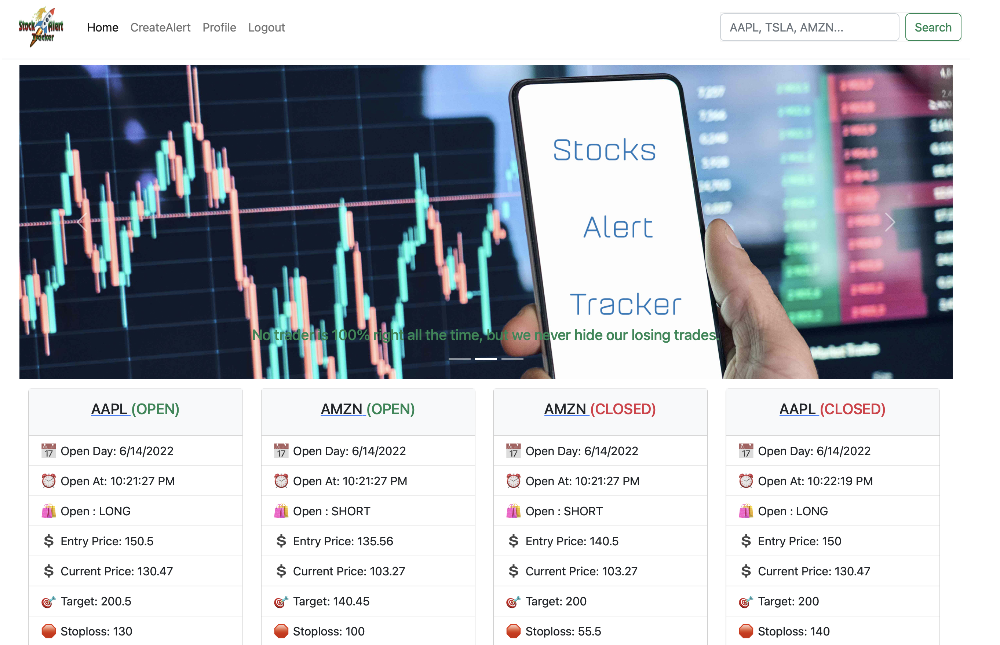
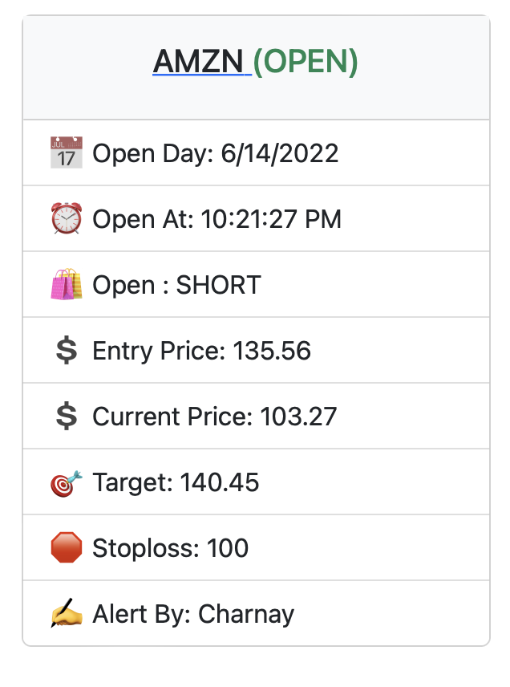
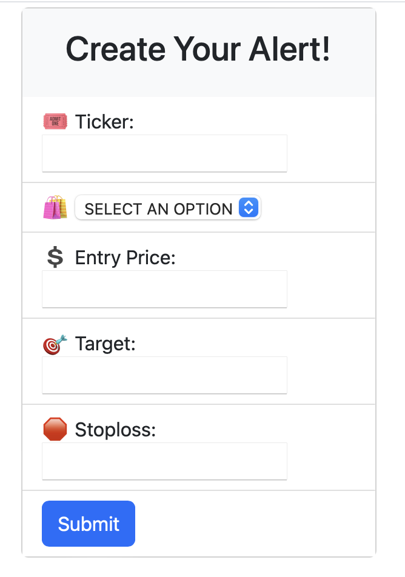
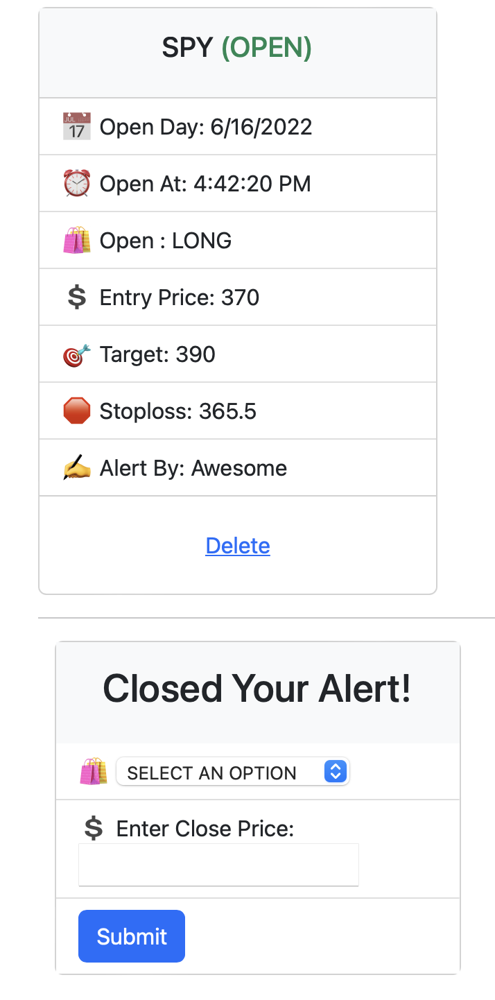
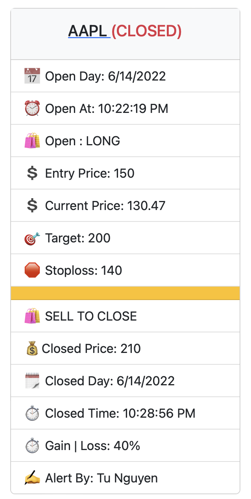

# Stock Alert Tracker

Repo: https://github.com/Danqest/15-Project2-Stock-Alert-Tracker

## Description
We're creating an app that users can log in with their personal credentials and they're able to create alerts to certain stocks of their choice. They're also able to follow other alerts created by other users
## Table of Contents

- [Stock Alert Tracker](#stock-alert-tracker)
  - [Description](#description)
  - [Table of Contents](#table-of-contents)
  - [Dependencies](#dependencies)
  - [Installation](#installation)
  - [Usage](#usage)
  - [Contribute](#contribute)
  - [Tests](#tests)
  - [Demo](#demo)
  - [Questions](#questions)
  - [License](#license)

## Dependencies

- HTML
- CSS
- Javascript (OOP, Node.js, ExpressJS, MySQL)

## Installation

You can run a local copy of this site by issuing the following commands.

```bash
$ git clone https://github.com/Danqest/15-Project2-Stock-Alert-Tracker.git
$ cd 15-Project2-Stock-Alert-TrackerL
$ Dont forget to run SOURCE schema.sql & seeds.sql in db folder
$ run npm init 
$ npm node .
```

## Usage

```md
As an investor, I should be able to create alerts for specific stocks of my choice and add them to a list. I should be able to follow other alerts created by other users. These alerts will send a message or a text when a stock goes up or down to a particular price target specified by the user.

```

## Contribute

1. Fork it
2. Create your feature branch (`git checkout -b my-new-feature`)
3. Commit your changes (`git commit -am 'Add some feature'`)
4. Push to the branch (`git push origin my-new-feature`)
5. Create new Pull Request

## Tests

```
NO TEST THIS TIME
```

## Demo

[Click here] (https://lit-waters-98495.herokuapp.com) 








## Questions

If you have questions about this repository reach me by Github: 

## License
Colin Brooks
Tu Nguyen
Charnay Birton
Harris Ai

